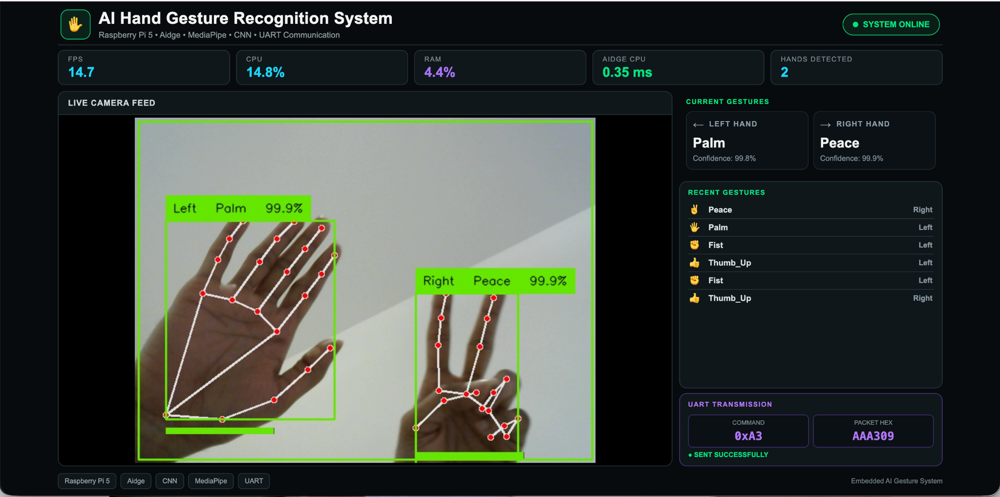
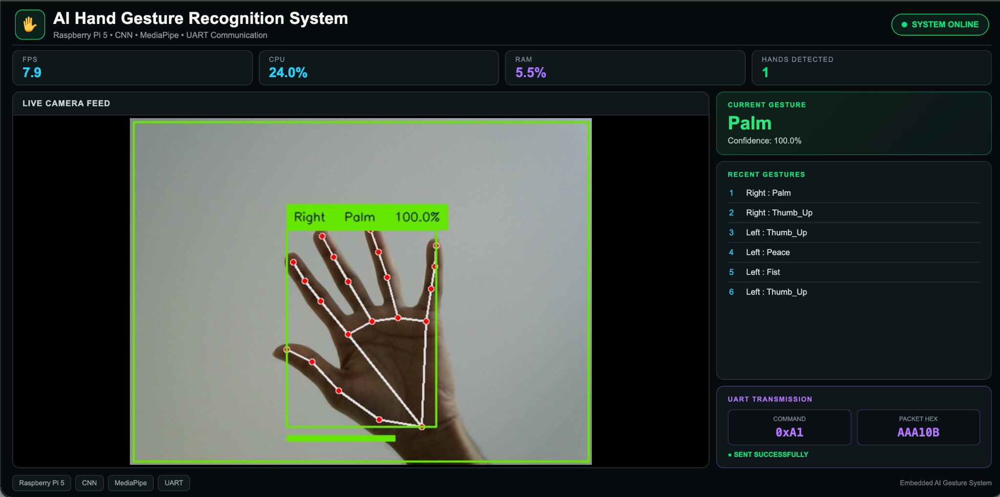
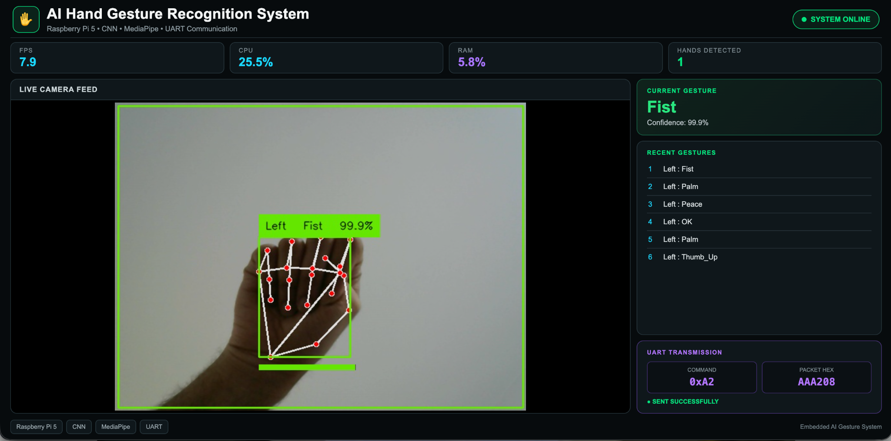
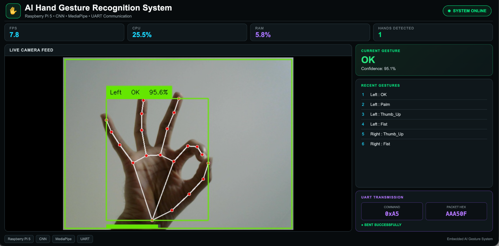
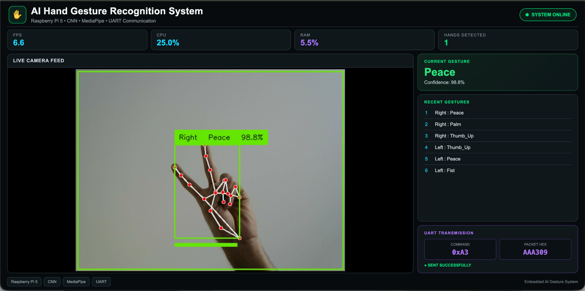
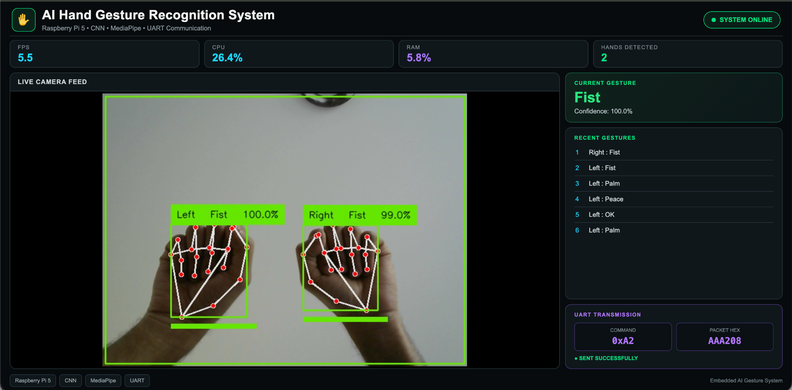

# AI-Based Hand Gesture Recognition using CNN, MediaPipe, Aidge & Raspberry Pi 5


## 📌 Overview

A real-time AI-based hand gesture recognition system running on a **Raspberry Pi 5**.

The system combines:

- MediaPipe for hand landmark detection
- CNN for gesture classification
- ONNX for model deployment
- Aidge CPU for edge inference
- Flask for real-time monitoring
- UART for embedded communication

The complete pipeline runs directly on the Raspberry Pi 5.

---

## 🚀 Features

- Real-time hand gesture recognition
- Left and right hand detection
- 21 MediaPipe hand landmarks
- CNN-based classification
- ONNX model deployment
- Aidge CPU edge inference
- Real-time confidence measurement
- Gesture stability verification
- UART hexadecimal commands
- Flask web dashboard
- Live inference latency monitoring
- Raspberry Pi 5 deployment

---

## 🧠 System Architecture

**Camera → MediaPipe → 21 Landmarks → Normalization → ONNX CNN → Aidge CPU → Gesture → UART**

The CNN receives **63 features**:

**21 landmarks × 3 coordinates (x, y, z) = 63 features**

---

## 🤲 Supported Gestures

| Gesture | UART Command |
|---|---|
| Palm | `0xA1` |
| Fist | `0xA2` |
| Peace | `0xA3` |
| Thumb Up | `0xA4` |
| OK | `0xA5` |

---

## ⚡ Aidge Edge AI

The trained TensorFlow/Keras model is exported to **ONNX** and executed using **Aidge CPU** on the Raspberry Pi 5.

### Model Information

| Property | Value |
|---|---|
| Input | 63 float32 features |
| Output Classes | 5 |
| ONNX Nodes | 37 |
| Operator Types | 6 |
| Native Operator Coverage | 100% |

### Performance

Model-only inference benchmark on Raspberry Pi 5:

| Runtime | Latency | Approx. FPS |
|---|---:|---:|
| TensorFlow | 6.14 ms | 162.84 FPS |
| Aidge CPU | 0.26 ms | 3850.48 FPS |

> These measurements represent **model inference only**, not complete end-to-end system performance. Camera capture, MediaPipe processing, UART, and dashboard processing are not included.

Aidge inference was also validated against TensorFlow using the same landmark inputs and produced matching gesture predictions with only floating-point-level numerical differences.

---

## 🌐 Real-Time Dashboard

The Flask dashboard provides live monitoring of the complete embedded AI system.

It displays:

- Left-hand gesture
- Right-hand gesture
- Confidence
- Aidge CPU latency
- Hands detected
- UART command
- UART packet
- UART status
- Recent gesture history

### Live Dashboard



---

## 📡 UART Communication

Gesture commands are transmitted using a simple hexadecimal packet:

**`AA + COMMAND + CHECKSUM`**

The checksum is calculated using XOR:

**`CHECKSUM = 0xAA XOR COMMAND`**

Example:

| Gesture | Packet |
|---|---|
| Palm | `AA A1 0B` |
| Peace | `AA A3 09` |
| Thumb Up | `AA A4 0E` |

This allows the Raspberry Pi to communicate gesture commands to another embedded device.

---

## 🏗️ Hardware

- Raspberry Pi 5
- USB Camera
- microSD Card
- Optional UART-connected embedded device

**Tested Camera:** Logitech C270

---

## 💻 Technologies

### AI / Machine Learning

- TensorFlow
- Keras
- CNN
- ONNX
- Aidge
- Aidge CPU

### Computer Vision

- MediaPipe
- OpenCV

### Embedded

- Raspberry Pi 5
- Linux
- UART

### Software

- Python
- NumPy
- Scikit-learn
- Flask
- PySerial
- Git / GitHub

---

## 📁 Project Structure

```text
Gesture-Recognition-CNN/
├── models/
│   ├── gesture_model.keras
│   ├── gesture_model.onnx
│   ├── gesture_model.zip
│   └── label_encoder.pkl
│
├── docs/
│   └── images/
│       ├── dashboard_aidge.png
│       ├── both_hands_fist.png
│       ├── fist_left.png
│       ├── ok_left.png
│       ├── palm_right.png
│       └── peace_right.png
│
├── src/
│   ├── app.py
│   ├── camera.py
│   ├── config.py
│   ├── detector.py
│   ├── hand_detector.py
│   ├── normalize.py
│   ├── predictor.py
│   ├── aidge_model.py
│   ├── stream.py
│   └── communication/
│
├── templates/
│   └── index.html
│
├── requirements.txt
├── requirements-aidge.txt
├── uart_test.py
├── LICENSE
└── README.md

---

## 📸 Live System Demonstration

The system was tested in real time on a **Raspberry Pi 5** using a USB camera.

### 🖐️ Palm Gesture



The system detects the hand landmarks using MediaPipe and classifies the gesture using the CNN running through Aidge.

---

### ✊ Fist Gesture



The detected gesture is stabilized using a short prediction history before sending the corresponding UART command.

---

### 👌 OK Gesture



The CNN recognizes the OK gesture from the normalized 21-point hand landmark representation.

---

### ✌️ Peace Gesture



The Peace gesture is classified in real time and mapped to its corresponding hexadecimal UART command.

---

### 🤲 Two-Hand Detection



The system supports simultaneous detection of the **left and right hands**.

Each detected hand is processed independently and can produce its own gesture prediction.

---

## 🌐 Real-Time Web Dashboard

A Flask-based web dashboard was developed to monitor the embedded AI system.

The dashboard provides real-time information including:

- Left-hand gesture
- Right-hand gesture
- Gesture confidence
- Aidge CPU inference latency
- Number of detected hands
- UART command
- UART packet
- UART transmission status
- Recent gesture history

### Dashboard

The dashboard provides a complete view of the **computer vision → AI inference → UART communication** pipeline running on the Raspberry Pi 5.

---

## 🧠 CNN Model

The gesture classifier uses a fully connected neural network trained on normalized MediaPipe hand landmarks.

### Input

**63 features**

`21 landmarks × 3 coordinates (x, y, z)`

### Architecture

| Layer | Configuration |
|---|---|
| Input | 63 features |
| Dense | 256 |
| Batch Normalization | — |
| Dropout | — |
| Dense | 128 |
| Batch Normalization | — |
| Dropout | — |
| Dense | 64 |
| Batch Normalization | — |
| Dense | 32 |
| Output | 5 classes |

**Total parameters:** 61,573

---

## ⚡ Aidge Integration

The original TensorFlow/Keras model was converted to **ONNX** and integrated with **Aidge CPU** for deployment on the Raspberry Pi 5.

### ONNX Model Validation

| Property | Result |
|---|---:|
| ONNX Nodes | 37 |
| Operator Types | 6 |
| Native Aidge Coverage | 100% |
| Input Shape | `1 × 63` |
| Data Type | `float32` |

The Aidge implementation was validated against the original TensorFlow model using the same landmark inputs.

Both runtimes produced the same predicted gesture with only very small floating-point differences.

---

## 📊 Inference Performance

The following benchmark compares isolated model inference on the Raspberry Pi 5.

| Runtime | Average Latency | Approx. FPS |
|---|---:|---:|
| TensorFlow | 6.14 ms | 162.84 FPS |
| Aidge CPU | 0.26 ms | 3850.48 FPS |

> **Note:** This is a model-only benchmark. It does not represent the complete camera-to-UART pipeline. MediaPipe processing, camera capture, UART communication, and dashboard processing are not included.

The application also measures the actual Aidge inference latency during live operation and displays it on the dashboard.

---

## 📡 UART Communication

The recognized gesture is converted into a hexadecimal command and transmitted through UART.

### Command Mapping

| Gesture | Command |
|---|---|
| Palm | `0xA1` |
| Fist | `0xA2` |
| Peace | `0xA3` |
| Thumb Up | `0xA4` |
| OK | `0xA5` |

### Packet Format

```text
AA + COMMAND + CHECKSUM


USB Camera
    ↓
OpenCV
    ↓
MediaPipe Hand Detection
    ↓
21 Hand Landmarks
    ↓
Landmark Normalization
    ↓
63 Input Features
    ↓
ONNX CNN Model
    ↓
Aidge CPU Inference
    ↓
Gesture Classification
    ↓
Confidence Filtering
    ↓
Gesture Stabilization
    ↓
UART Command Generation
    ↓
Embedded Device
